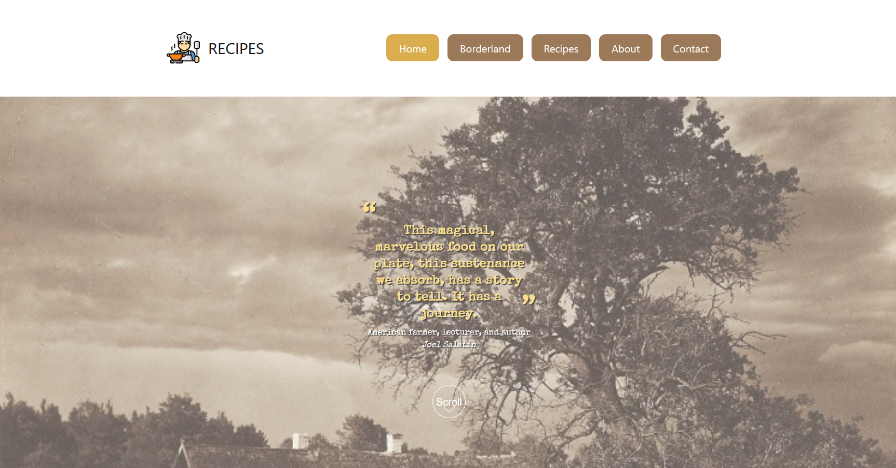
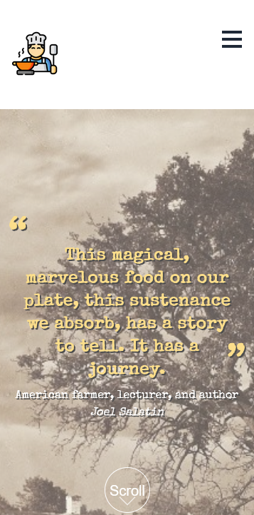

# A Culinary Journey

Welcome to A Culinary Journey, a website dedicated to promoting the forgotten regional meals from the Polish Kresy region. Here, we aim to inspire you in the kitchen and help you rediscover the tastes of older generations. Our hope is that you can experience, if only for a moment, the unique smell and flavor of the Kresy region.

## Why This Website?

The goal of this website is to bring attention to and promote the traditional, forgotten recipes from the Polish Kresy region. These recipes represent a rich culinary heritage that deserves to be rediscovered and cherished.

## Features

    - Recipes: Explore a collection of traditional recipes from the Kresy region.
    - Old Recipes Website: A nostalgic look at regional meals and their historical significance.

## Technologies Used

    - Astro: The website is built using Astro, a modern static site generator.
    - Vue Components: Interactive components are created using Vue.js.
    - Tailwind CSS: For styling, we use Tailwind CSS to ensure a beautiful and responsive design.

## Screenshots
Desktop View

Mobile View

# Final Result

To see the final result of this project, click [here](https://darekrepos.github.io/recipes/).

I love to receive feedback on improving my site. If you encounter any problems or have suggestions, please report them. Your input is greatly appreciated!

Thank you for visiting A Culinary Journey. Enjoy exploring the tastes and smells of the forgotten Kresy region!